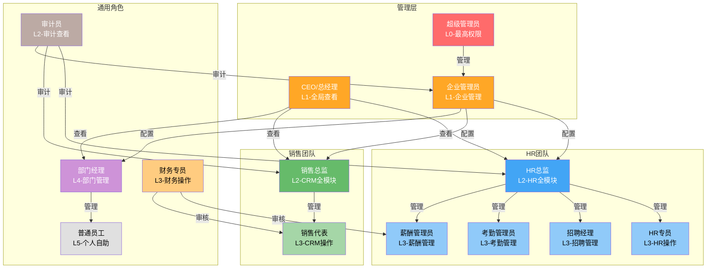

# 用户角色分析文档

## MITEDTSM CRM + OA 子系统

---

## 文档信息

| 项目 | 内容 |
|------|------|
| 产品名称 | MITEDTSM CRM + OA 子系统 |
| 文档类型 | 用户角色分析 |
| 参考来源 | 01-Business/User_Roles.md, 02-SRS/MIT-FMP-SRS.md |
| 版本号 | V1.0 |
| 创建日期 | 2026-06-25 |

---

## 1. 角色总览

CRM + OA 子系统共定义 **14种用户角色**，按权限级别分为6级（L0-L5），确保每个角色在系统中拥有明确的职责边界和权限范围。

### 1.1 角色列表

| 级别 | 角色编码 | 角色名称 | 管理范畴 |
|------|----------|----------|----------|
| L0 | ROLE_SUPER_ADMIN | 超级管理员 | 系统全局最高权限 |
| L1 | ROLE_COMPANY_ADMIN | 企业管理员 | 企业内部系统管理 |
| L1 | ROLE_CEO | CEO/总经理 | 企业全局查看+高级审批 |
| L2 | ROLE_HR_DIRECTOR | HR总监 | HR全模块管理 |
| L2 | ROLE_SALES_DIRECTOR | 销售总监 | CRM全模块管理 |
| L2 | ROLE_AUDITOR | 审计员 | 操作审计与合规 |
| L3 | ROLE_HR_SPECIALIST | HR专员 | HR日常事务执行 |
| L3 | ROLE_RECRUIT_MANAGER | 招聘经理 | 招聘全流程 |
| L3 | ROLE_ATTENDANCE_ADMIN | 考勤管理员 | 考勤制度与数据 |
| L3 | ROLE_SALARY_ADMIN | 薪酬管理员 | 薪酬体系与核算 |
| L3 | ROLE_SALES_REP | 销售代表 | 客户开发与销售执行 |
| L3 | ROLE_FINANCE_SPECIALIST | 财务专员 | 财务审核与操作 |
| L4 | ROLE_DEPT_MANAGER | 部门经理 | 部门日常管理 |
| L5 | ROLE_EMPLOYEE | 普通员工 | 个人事务自助 |

### 1.2 权限级别说明

| 级别 | 命名 | 数据范围 | 典型权限 |
|------|------|----------|----------|
| L0 | 系统级 | 全部租户 | 租户管理、系统参数、全局配置 |
| L1 | 企业级管理 | 本企业全部 | 组织架构、高级审批、全量数据查看 |
| L2 | 领域级管理 | 本企业全部(按领域) | HR或CRM全模块管理、报表分析 |
| L3 | 模块级操作 | 按角色限定 | 模块内日常操作、数据录入 |
| L4 | 部门级管理 | 本部门及下级 | 下属管理、部门审批 |
| L5 | 个人级 | 仅本人 | 个人打卡、请假、任务、工资条 |

---

## 2. CRM+OA 核心角色详细分析

### 2.1 超级管理员 (Super Admin)

| 属性 | 描述 |
|------|------|
| **角色编码** | ROLE_SUPER_ADMIN |
| **权限级别** | L0 — 最高权限 |
| **职责** | 系统全局管理，拥有所有权限 |
| **典型用户** | IT部门负责人、系统实施工程师 |

**CRM+OA核心功能:**
- 系统初始化配置
- 数据字典维护（客户来源、行业、商机阶段等下拉选项）
- 审批流程定义与发布（Flowable BPMN配置）
- 操作日志审计
- 系统参数配置
- 所有业务模块管理权限

---

### 2.2 销售总监 (Sales Director)

| 属性 | 描述 |
|------|------|
| **角色编码** | ROLE_SALES_DIRECTOR |
| **权限级别** | L2 — CRM全模块管理 |
| **职责** | 销售战略制定，团队管理，业绩考核 |
| **典型用户** | 销售总监、VP of Sales |

**CRM+OA核心功能:**
- 客户资源分配（将公海/线索分配给销售代表）
- 客户归属转移（销售代表离职时批量转移客户）
- 销售漏斗分析（各阶段商机数量/金额/转化率）
- 销售预测（基于商机金额×赢单概率）
- 团队业绩排名（按销售额/回款率/商机转化率）
- 产品与报价管理（产品目录、报价单审批）
- 合同审批（高级别、大额合同）
- 营销活动审批
- 公海规则配置（保护天数、领取上限等）

---

### 2.3 销售代表 (Sales Representative)

| 属性 | 描述 |
|------|------|
| **角色编码** | ROLE_SALES_REP |
| **权限级别** | L3 — CRM操作权限，个人数据范围 |
| **职责** | 客户开发与维护，销售执行 |
| **典型用户** | 销售代表、客户经理 |

**CRM+OA核心功能:**
- 客户信息管理（个人归属客户CRUD）
- 联系人管理（添加/编辑/删除/设首要联系人）
- 线索管理（录入/跟进/转化/放弃/公海领取）
- 商机管理（创建/阶段推进/产品关联/报价）
- 订单管理（创建/提交审批/查看状态）
- 跟进记录（每次客户接触后录入）
- 客户拜访申请（外勤审批）
- 回款计划跟踪
- 个人业绩查看
- 工作报告（日报/周报/月报）
- 任务管理（个人任务+被分配任务）
- 日程管理（个人日程+团队日程）

---

### 2.4 财务专员 (Finance Specialist)

| 属性 | 描述 |
|------|------|
| **角色编码** | ROLE_FINANCE_SPECIALIST |
| **权限级别** | L3 — 财务操作权限 |
| **职责** | 财务审核与操作 |
| **典型用户** | 财务会计、出纳 |

**CRM+OA核心功能:**
- 回款确认（确认客户付款到账，更新订单已回款金额）
- 回款审批（审核回款申请）
- 退款处理（审核退款申请，执行退款）
- 发票管理（开票/邮寄/作废，关联订单）
- 费用报销审批（审核报销单，确认打款）
- 借款审批（审核借款申请）
- 财务报表查看（收入/支出/回款/应收账款）
- 财务数据汇总（总回款/总开票/总退款/回款率/净利润）

---

### 2.5 部门经理 (Department Manager)

| 属性 | 描述 |
|------|------|
| **角色编码** | ROLE_DEPT_MANAGER |
| **权限级别** | L4 — 部门级管理 |
| **职责** | 部门日常管理，团队绩效管理 |
| **典型用户** | 各部门经理、Team Leader |

**CRM+OA核心功能:**
- 部门客户数据查看（本部门销售代表的客户）
- 部门商机/订单查看
- 审批操作（下属请假/出差/报销/借款/拜访审批）
- 任务分配（向下属分配任务）
- 下属工作报告查看与评论
- 下属绩效考核参与

---

### 2.6 普通员工 (Employee)

| 属性 | 描述 |
|------|------|
| **角色编码** | ROLE_EMPLOYEE |
| **权限级别** | L5 — 个人数据权限 |
| **职责** | 个人事务处理，日常OA操作 |
| **典型用户** | 全体员工 |

**CRM+OA核心功能:**
- 个人OA申请（请假/出差/借款/报销/请示）
- 工作报告（日报/周报/月报撰写与提交）
- 任务管理（查看和处理分配的任务）
- 日程管理（个人日程CRUD + 团队日程查看）
- 文档管理（上传/下载/共享文档）
- 审批处理（如有审批权限，处理待办审批）
- 公司公告查看
- 个人信息查看与修改申请

---

### 2.7 企业管理员 (Company Admin)

| 属性 | 描述 |
|------|------|
| **角色编码** | ROLE_COMPANY_ADMIN |
| **权限级别** | L1 — 企业级管理权限 |
| **职责** | 企业内部系统管理，组织架构维护 |
| **典型用户** | 企业IT管理员、行政总监 |

**核心功能:**
- 组织架构管理（部门、岗位CRUD）
- 用户账号管理（创建、禁用、重置密码）
- 角色与权限分配
- 基础数据配置（审批流程、假期规则等）
- 企业级参数设置
- 操作日志查看（本企业范围）

---

### 2.8 CEO/总经理 (CEO / General Manager)

| 属性 | 描述 |
|------|------|
| **角色编码** | ROLE_CEO |
| **权限级别** | L1 — 企业全量查看 + 高级审批 |
| **职责** | 企业全局管理与决策 |
| **典型用户** | CEO、总经理 |

**核心功能:**
- 管理驾驶舱（企业全局数据KPI）
- 所有HR/CRM数据查看
- 高级审批（大额合同、高管异动等）
- 组织架构调整审批
- 战略报表查看
- 公司公告发布

---

### 2.9 HR总监 (HR Director)

| 属性 | 描述 |
|------|------|
| **角色编码** | ROLE_HR_DIRECTOR |
| **权限级别** | L2 — HR全模块管理权限 |
| **职责** | 人力资源管理战略决策，HR团队管理 |
| **典型用户** | HRD、人力资源总监 |

**核心功能:**
- 人力资源规划
- 招聘需求审批
- 薪酬体系管理
- 绩效方案制定
- 培训计划审批
- HR数据报表与分析
- 组织架构调整建议
- 员工异动审批（高级别）

---

### 2.10 HR专员 (HR Specialist)

| 属性 | 描述 |
|------|------|
| **角色编码** | ROLE_HR_SPECIALIST |
| **权限级别** | L3 — HR操作权限 |
| **职责** | 日常HR事务执行 |
| **典型用户** | HR专员、招聘专员、薪酬专员 |

**核心功能:**
- 招聘职位发布与简历筛选
- 面试安排与记录
- 员工入职、转正、异动办理
- 考勤数据管理
- 薪酬核算与发放
- 绩效考核执行
- 员工档案管理
- 培训执行

---

### 2.11 招聘经理 (Recruitment Manager)

| 属性 | 描述 |
|------|------|
| **角色编码** | ROLE_RECRUIT_MANAGER |
| **权限级别** | L3 — 招聘模块管理权限 |
| **职责** | 招聘全流程管理 |
| **典型用户** | 招聘经理、TA Manager |

**核心功能:**
- 招聘需求管理
- 招聘渠道管理
- 简历库管理
- 面试安排与协调
- 面试评价汇总
- Offer审批
- 招聘数据分析
- 人才库维护

---

### 2.12 考勤管理员 (Attendance Admin)

| 属性 | 描述 |
|------|------|
| **角色编码** | ROLE_ATTENDANCE_ADMIN |
| **权限级别** | L3 — 考勤模块管理权限 |
| **职责** | 考勤制度维护与考勤数据管理 |
| **典型用户** | 考勤专员、HR运营 |

**核心功能:**
- 班次管理
- 考勤规则配置
- 考勤异常处理（补卡、修正）
- 加班审批
- 考勤数据导出
- 考勤报表生成

---

### 2.13 薪酬管理员 (Salary Admin)

| 属性 | 描述 |
|------|------|
| **角色编码** | ROLE_SALARY_ADMIN |
| **权限级别** | L3 — 薪酬模块管理权限 |
| **职责** | 薪酬体系维护与薪酬核算 |
| **典型用户** | 薪酬专员、C&B Specialist |

**核心功能:**
- 薪酬规则配置
- 薪酬字段定义
- 薪酬核算
- 薪酬发放
- 薪酬调整
- 薪酬报表
- 社保公积金管理

---

### 2.14 审计员 (Auditor)

| 属性 | 描述 |
|------|------|
| **角色编码** | ROLE_AUDITOR |
| **权限级别** | L2 — 审计查看权限 |
| **职责** | 系统操作审计与合规检查 |
| **典型用户** | 内审人员、合规专员 |

**核心功能:**
- 操作日志全面查看
- 登录日志查看
- 数据变更记录查看
- 审计报告生成
- 敏感操作监控
- 合规检查

---

## 3. 模块权限矩阵

### 3.1 完整模块权限矩阵

| 角色 | 系统管理 | 组织管理 | 招聘 | 员工 | 考勤 | 绩效 | 薪酬 | OA | CRM | 报表 | 审批 | 审计 |
|------|:--:|:--:|:--:|:--:|:--:|:--:|:--:|:--:|:--:|:--:|:--:|:--:|
| 超级管理员 | ● | ● | ● | ● | ● | ● | ● | ● | ● | ● | ● | ● |
| 企业管理员 | ◐ | ● | ◐ | ◐ | ◐ | ◐ | ◐ | ◐ | ◐ | ◐ | ◐ | ◐ |
| HR总监 | ○ | ◐ | ● | ● | ● | ● | ● | ◐ | ○ | ● | ● | ○ |
| HR专员 | ○ | ○ | ◐ | ◐ | ◐ | ◐ | ◐ | ○ | ○ | ○ | ○ | ○ |
| 部门经理 | ○ | ○ | ◐ | ○ | ◐ | ◐ | ○ | ◐ | ○ | ○ | ◐ | ○ |
| 销售总监 | ○ | ○ | ○ | ○ | ○ | ○ | ○ | ○ | ● | ● | ◐ | ○ |
| 销售代表 | ○ | ○ | ○ | ○ | ○ | ○ | ○ | ○ | ◐ | ○ | ○ | ○ |
| 普通员工 | ○ | ○ | ○ | ○ | ○ | ○ | ○ | ◐ | ○ | ○ | ○ | ○ |
| 财务专员 | ○ | ○ | ○ | ○ | ○ | ○ | ◐ | ○ | ◐ | ○ | ◐ | ○ |
| CEO/总经理 | ○ | ◐ | ○ | ○ | ○ | ○ | ○ | ○ | ○ | ● | ● | ○ |
| 招聘经理 | ○ | ○ | ● | ◐ | ○ | ○ | ○ | ○ | ○ | ○ | ○ | ○ |
| 考勤管理员 | ○ | ○ | ○ | ○ | ● | ○ | ○ | ○ | ○ | ○ | ○ | ○ |
| 薪酬管理员 | ○ | ○ | ○ | ○ | ○ | ○ | ● | ○ | ○ | ○ | ○ | ○ |
| 审计员 | ○ | ○ | ○ | ○ | ○ | ○ | ○ | ○ | ○ | ○ | ○ | ● |

> **图例**: ● 全权限 | ◐ 部分权限 | ○ 无权限

### 3.2 CRM+OA子系统权限矩阵

| 角色 | 客户 | 商机 | 订单 | 回款 | 发票 | 退款 | 报销 | 工单 | 营销 | 审批 | 报告 | 任务 | 日程 | 文档 |
|------|:---:|:---:|:---:|:---:|:---:|:---:|:---:|:---:|:---:|:---:|:---:|:---:|:---:|:---:|
| 超级管理员 | ● | ● | ● | ● | ● | ● | ● | ● | ● | ● | ● | ● | ● | ● |
| CEO/总经理 | ○ | ○ | ○ | ○ | ○ | ○ | ○ | ○ | ○ | ● | ● | ○ | ○ | ○ |
| 销售总监 | ● | ● | ● | ○ | ○ | ○ | ○ | ○ | ● | ◐ | ● | ◐ | ◐ | ◐ |
| 销售代表 | ◐ | ◐ | ◐ | ○ | ○ | ○ | ○ | ○ | ○ | ○ | ○ | ● | ● | ● |
| 财务专员 | ○ | ○ | ○ | ● | ● | ● | ● | ○ | ○ | ◐ | ◐ | ○ | ○ | ○ |
| 部门经理 | ○ | ○ | ○ | ○ | ○ | ○ | ○ | ○ | ○ | ◐ | ○ | ◐ | ◐ | ◐ |
| 普通员工 | ○ | ○ | ○ | ○ | ○ | ○ | ◐ | ○ | ○ | ○ | ● | ● | ● | ● |
| 审计员 | ○ | ○ | ○ | ○ | ○ | ○ | ○ | ○ | ○ | ○ | ○ | ○ | ○ | ○ |

> **图例**: ● 全权限(管理+操作) | ◐ 部分权限(个人/部门数据范围) | ○ 查看权限或无权限

### 3.3 数据权限矩阵

| 角色 | CRM数据范围 | OA数据范围 | HR数据范围 |
|------|------------|------------|------------|
| 超级管理员 | 全部租户 | 全部租户 | 全部租户 |
| 企业管理员 | 本企业全部 | 本企业全部 | 本企业全部 |
| CEO/总经理 | 本企业全部 | 本企业全部 | 本企业全部 |
| HR总监 | — | 本人 | 全部HR数据 |
| HR专员 | — | 本人 | 日常操作范围 |
| 销售总监 | 全部CRM数据 | 本部门及下级 | — |
| 销售代表 | 仅本人客户及关联数据 | 仅本人 | — |
| 财务专员 | 全部财务数据 | 仅本人 | — |
| 部门经理 | 本部门下属数据 | 本部门及下级 | 本部门下属 |
| 普通员工 | 无CRM权限 | 仅本人 | 仅本人 |
| 招聘经理 | — | 仅本人 | 招聘相关数据 |
| 考勤管理员 | — | 仅本人 | 全部考勤数据 |
| 薪酬管理员 | — | 仅本人 | 全部薪酬数据(敏感) |
| 审计员 | 全部(只读) | 全部(只读) | 全部(只读) |

---

## 4. 角色关系图



## 5. 权限继承关系

```
超级管理员 (L0)
  └── 企业管理员 (L1)
        ├── HR总监 (L2)
        │     ├── HR专员 (L3)
        │     ├── 招聘经理 (L3)
        │     ├── 考勤管理员 (L3)
        │     └── 薪酬管理员 (L3)
        ├── 销售总监 (L2)
        │     └── 销售代表 (L3)
        ├── 部门经理 (L4)
        │     └── 普通员工 (L5)
        ├── 财务专员 (L3)
        └── 审计员 (L2)
```

---

## 6. 角色与模块对应表

| 模块 | 管理角色 | 操作角色 | 查看角色 |
|------|----------|----------|----------|
| 系统管理 | 超级管理员 | 企业管理员 | — |
| 组织管理 | 企业管理员 | HR总监 | CEO、审计员 |
| 招聘管理 | 招聘经理、HR总监 | HR专员 | CEO、部门经理 |
| 员工管理 | HR总监 | HR专员 | 部门经理、审计员 |
| 考勤管理 | 考勤管理员 | HR专员 | 部门经理、员工 |
| 绩效管理 | HR总监 | HR专员、部门经理 | CEO、员工 |
| 薪酬管理 | 薪酬管理员 | HR专员 | 财务专员、员工 |
| OA协同 | 企业管理员 | 所有角色 | 所有角色 |
| CRM客户 | 销售总监 | 销售代表 | CEO、审计员 |
| 报表分析 | CEO | HR总监、销售总监 | 部门经理 |
| 审批流程 | 企业管理员 | 所有角色 | 审计员 |
| 审计日志 | 审计员 | 超级管理员 | 企业管理员 |

---

## 7. 角色与审批权限对照

| 审批类型 | 可发起角色 | 一级审批人 | 二级审批人(条件触发) |
|----------|-----------|------------|---------------------|
| 订单审批 | 销售代表 | 销售总监 | CEO (金额>10万) |
| 回款审批 | 财务专员 | 财务主管 | — |
| 退款审批 | 财务专员 | 销售总监→CEO | (金额>5万多级) |
| 报销审批 | 普通员工 | 部门经理 | 财务→CEO (金额>5000) |
| 请假审批 | 普通员工 | 部门经理 | — |
| 出差审批 | 普通员工 | 部门经理 | CEO (预算>5000) |
| 借款审批 | 普通员工 | 部门经理→财务 | CEO (金额>1万) |
| 拜访审批 | 销售代表 | 销售总监 | — |
| 请示审批 | 普通员工 | 部门经理 | — |

---

## 8. 文档变更记录

| 版本 | 日期 | 变更内容 | 变更人 |
|------|------|----------|--------|
| V1.0 | 2026-06-25 | 初始版本，参考01-Business/User_Roles.md | 需求分析团队 |
