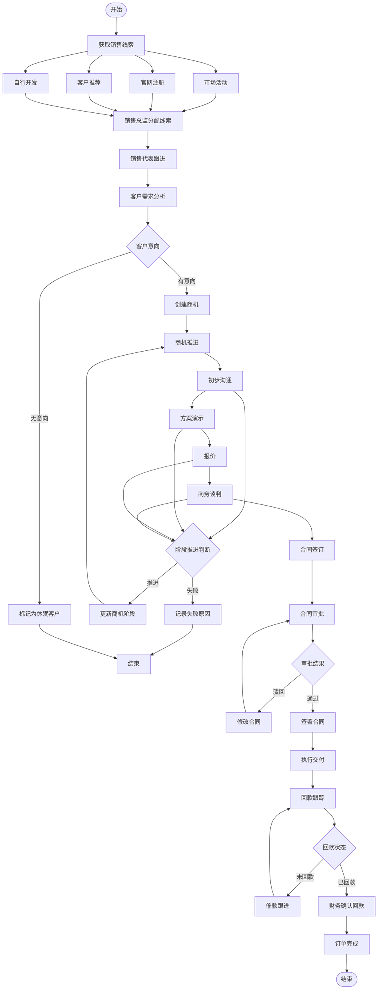
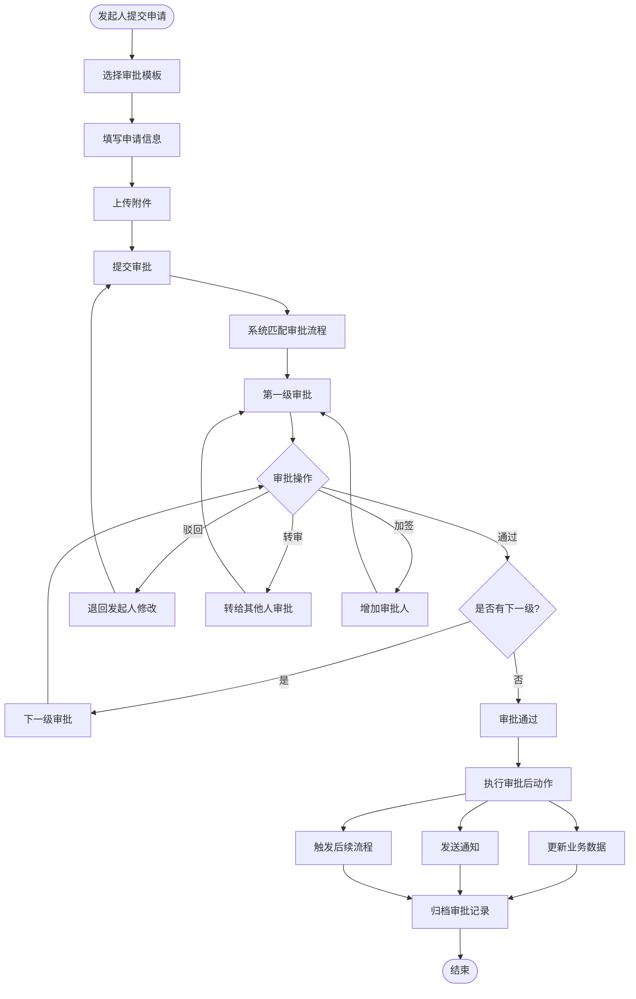
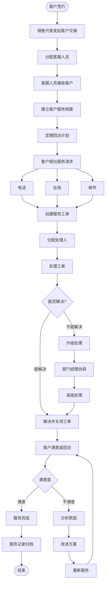
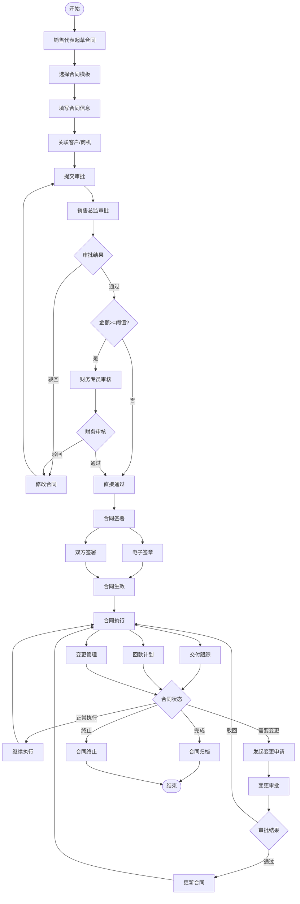

# 核心业务流程详细文档

## MITEDTSM CRM + OA 子系统

---

## 文档信息

| 项目 | 内容 |
|------|------|
| 产品名称 | MITEDTSM CRM + OA 子系统 |
| 文档类型 | 核心业务流程详细文档 |
| 参考来源 | 01-Business/Business_Process.md |
| 版本号 | V1.0 |
| 创建日期 | 2026-06-25 |

---

## 流程总览

本文档共包含 **10个核心业务流程**，覆盖CRM和OA两大业务域。每个流程均包含角色、步骤、输入输出及异常分支。

| 编号 | 流程名称 | 业务域 | 涉及角色 | 优先级 |
|------|----------|--------|----------|--------|
| BP-07 | 销售管理流程 | CRM | 销售代表、销售总监、财务专员 | **P0** |
| BP-08 | 审批流程 | OA | 全体员工、各级审批人 | **P0** |
| BP-10 | 客户服务流程 | CRM | 销售代表、客服人员、部门经理 | **P0** |
| BP-09 | 合同管理流程 | CRM | 销售代表、销售总监、财务专员 | P1 |
| BP-04 | 考勤管理流程 | HRM | 员工、考勤管理员、部门经理 | P1 |
| BP-01 | 招聘全流程 | HRM | 部门经理、招聘经理、HR专员、HR总监 | P2 |
| BP-02 | 员工入职流程 | HRM | HR专员、部门经理、IT管理员、新员工 | P2 |
| BP-03 | 员工异动流程 | HRM | 员工、部门经理、HR专员、HR总监 | P2 |
| BP-05 | 绩效考核流程 | HRM | 员工、部门经理、HR总监 | P2 |
| BP-06 | 薪酬核算流程 | HRM | 薪酬管理员、HR专员、财务专员、HR总监 | P2 |

> **注**: P0流程为CRM+OA子系统MVP核心交付，P1/P2流程依赖HR模块，为后续迭代范围。详细HR流程描述参见 `01-Business/Business_Process.md`。

---

## BP-07 销售管理流程 (P0)

### 流程概述
从线索获取、客户跟进、商机推进到合同签订、回款确认的完整销售漏斗流程，是CRM子系统的核心业务流程。

### 涉及角色
- **销售代表**: 客户开发、跟进、报价、签约
- **销售总监**: 客户分配、商机审批、策略指导
- **财务专员**: 回款确认

### 流程图



### 输入输出

| 阶段 | 输入 | 输出 |
|------|------|------|
| 线索获取 | 市场活动、注册信息 | 线索记录 |
| 客户跟进 | 客户信息、沟通记录 | 跟进记录 |
| 商机推进 | 商机信息、推进阶段 | 商机状态更新 |
| 合同签订 | 报价单、合同模板 | 已签署合同 |
| 回款确认 | 银行流水、回款凭证 | 回款记录 |

### 关键节点说明

| 节点 | 系统行为 | 数据变更 |
|------|----------|----------|
| 获取线索 | 多渠道线索汇入 | 创建 `crm_leads` 记录，状态=NEW |
| 分配/认领 | 销售总监分配或销售代表从公海领取 | 更新 `owner_id` |
| 创建商机 | 线索转化或独立创建 | 创建 `crm_opportunity`，阶段=初步接触 |
| 阶段推进 | 更新商机阶段，记录推进日志 | 更新 `stage`，记录 `change_log` |
| 合同签订 | 基于报价单生成合同 | 创建 `crm_order`，状态=未提交 |
| 合同审批 | 启动Flowable审批流程 | 更新订单状态为审批中 |
| 回款确认 | 财务确认到账 | 更新 `received_amount` |
| 订单完成 | 所有回款完成 | 订单状态=已完成 |

### 异常分支

| 异常 | 处理方式 |
|------|----------|
| 线索重复 | 系统自动检测名称+手机号查重，提示合并 |
| 客户超30天无跟进 | 自动掉入公海(定时任务每日2:00) |
| 商机长时间停滞 | 系统提醒(7天未跟进红色预警) |
| 商机输单 | 必填输单原因+竞争对手 |
| 合同审批驳回 | 退回修改后重新提交审批 |
| 回款逾期 | 1-3天预警/4-7天警告/8+天严重，分级通知 |
| 订单金额超阈值 | 自动升级为多级审批 |

---

## BP-08 审批流程 (P0)

### 流程概述
基于Flowable工作流引擎的通用审批流程，支持自定义审批模板、条件分支、会签、转审、加签等功能。CRM+OA子系统覆盖9类审批场景。

### 涉及角色
- **发起人**: 提交审批申请
- **审批人**: 各级审批节点
- **抄送人**: 知悉审批结果

### 流程图



### 9类审批场景

| 审批类型 | 审批模板 | 默认审批层级 | 条件升级规则 |
|----------|----------|-------------|-------------|
| 订单审批 | 标准审批 | 2级(销售总监→CEO) | 金额>10万升级 |
| 回款审批 | 简单审批 | 1级(财务主管) | — |
| 退款审批 | 复杂审批 | 2级(销售总监→CEO) | 金额>5万升级 |
| 报销审批 | 条件审批 | 1级(部门经理) | 金额>5000两级/>20000三级 |
| 请假审批 | 简单审批 | 1级(部门经理) | — |
| 出差审批 | 条件审批 | 1级(部门经理) | 预算>5000升级 |
| 借款审批 | 条件审批 | 2级(部门经理→财务) | 金额>1万加CEO |
| 拜访审批 | 简单审批 | 1级(销售总监) | — |
| 请示审批 | 简单审批 | 1级(部门经理) | — |

### 审批操作说明

| 操作 | 说明 | 效果 |
|------|------|------|
| 通过 | 同意申请 | 流转到下一节点；如为最后节点则审批完成 |
| 驳回 | 不同意申请 | 退回发起人，发起人可修改后重新提交 |
| 否决 | 终态拒绝 | 审批终结，不可重新提交 |
| 转办 | 转给他人审批 | 当前审批人改为指定人员 |
| 加签 | 增加审批人 | 在原审批节点增加一个审批人 |
| 撤回 | 发起人撤回 | 审批完成前可撤回，审批单取消 |

### 异常分支

| 异常 | 处理方式 |
|------|----------|
| 审批人离职 | 自动转给直属上级或指定代理人 |
| 审批超时(>48h) | 系统自动催办提醒，超72h升级通知上级 |
| 撤回 | 发起人在任何节点审批前可撤回 |
| 并发冲突 | 同一审批单多人同时操作时，先提交者胜出 |

---

## BP-10 客户服务流程 (P0)

### 流程概述
客户成交后的持续服务管理，包括工单创建、分配、处理、SLA管理和满意度回访。

### 涉及角色
- **销售代表**: 客户交接、服务跟踪
- **客服人员**: 工单处理、服务记录
- **部门经理**: 服务监督、质量检查

### 流程图



### 输入输出

| 阶段 | 输入 | 输出 |
|------|------|------|
| 客户交接 | 合同信息、客户需求 | 服务档案 |
| 工单处理 | 客户请求 | 处理结果 |
| 满意度回访 | 服务记录 | 满意度评分 |

### SLA管理

| 优先级 | 响应时限 | 处理时限 | 超时动作 |
|--------|----------|----------|----------|
| 高 | 30分钟 | 4小时 | 提醒→超2倍SLA升级至经理 |
| 中 | 1小时 | 8小时 | 提醒→超2倍SLA升级 |
| 低 | 4小时 | 24小时 | 提醒 |

### 工单状态流转

```
创建(待处理) → 已分配 → 处理中 → 已完结
                ↓
             信息不足 → 被退回 → 发起人补充 → 重新提交
```

### 异常分支

| 异常 | 处理方式 |
|------|----------|
| 工单超时 | 每30分钟检查，超SLA自动提醒+升级 |
| 客户投诉 | 标记为"投诉"类型，优先处理 |
| 处理人变更 | 自动交接当前工单 |
| 无匹配处理人 | 放入未分配池，通知客服经理 |

---

## BP-09 合同管理流程 (P1)

### 流程概述
从合同起草、审批、签署、执行到归档的合同全生命周期管理。

### 涉及角色
- **销售代表**: 合同起草、执行跟踪
- **销售总监**: 合同审批
- **财务专员**: 财务审核

### 流程图



### 输入输出

| 阶段 | 输入 | 输出 |
|------|------|------|
| 起草 | 商机信息、报价单、合同模板 | 合同草稿 |
| 审批 | 合同草稿 | 审批结果 |
| 签署 | 已审批合同 | 已签署合同 |
| 归档 | 已完成合同 | 合同归档记录 |

### 核心节点

| 阶段 | 系统行为 | 状态变更 |
|------|----------|----------|
| 起草 | 基于商机/报价单创建订单 | 状态=未提交 |
| 审批 | 启动Flowable审批流程 | 状态=审批中 |
| 签署 | 审批通过后确认 | 状态=已通过 |
| 执行 | 进入回款和交付阶段 | 状态=已确认 |
| 变更 | 已确认后需修改 | 发起变更流程，版本管理 |
| 归档 | 订单完成 | 状态=已完成 |

### 异常分支

| 异常 | 处理方式 |
|------|----------|
| 金额超权限 | 自动升级审批层级 |
| 审批驳回 | 修改后重新提交 |
| 合同变更 | 发起变更流程，版本号+1 |
| 订单取消 | 仅未提交/被驳回状态可取消→已撤销 |
| 合同逾期 | 自动提醒，标记风险 |

---

## HR流程参考 (P1/P2，后续迭代)

以下HR流程为MIT-FMP完整平台设计，CRM+OA子系统的MVP阶段不做实现，在此列出供后续迭代参考。详细Mermaid流程图参见 `01-Business/Business_Process.md`。

### BP-01 招聘全流程 (P2)

**涉及角色**: 部门经理、招聘经理、HR专员、HR总监

**核心节点**: 需求提出→HR总监审批→职位发布→多渠道同步→简历筛选→初试→复试→背调→Offer审批→发送Offer→入职

**输入输出**:

| 阶段 | 输入 | 输出 |
|------|------|------|
| 需求提出 | 部门人员缺口、业务需求 | 招聘需求单 |
| 职位发布 | 招聘需求单、JD模板 | 发布职位信息 |
| 简历筛选 | 候选人简历 | 筛选通过/淘汰记录 |
| 面试安排 | 面试官日程、候选人时间 | 面试通知 |
| Offer发放 | 薪资方案、职级 | Offer Letter |

**关键规则**:
- 同一候选人不可重复投递同一岗位
- 黑名单候选人投递时自动拦截
- 面试时间需至少提前1小时通知
- 背调未通过需HR评估风险后决定是否继续
- Offer被拒可调整方案或关闭流程

**异常分支**:
| 异常 | 处理方式 |
|------|----------|
| 招聘需求被驳回 | 部门经理修改后重新提交 |
| 面试官时间冲突 | 系统自动协调面试时间 |
| 候选人放弃 | 关闭流程，记录原因 |
| 背调未通过 | HR评估风险，决定是否继续 |

---

### BP-02 员工入职流程 (P2)

**涉及角色**: HR专员、部门经理、IT管理员、新员工

**核心节点**: 发起入职→生成任务清单→填写个人信息→上传材料→材料审核→创建档案→生成合同→签署合同→开通账号→分配工位/设备→入职培训→分配导师→确认入职

**输入输出**:

| 阶段 | 输入 | 输出 |
|------|------|------|
| 发起入职 | Offer确认信息 | 入职任务清单 |
| 信息采集 | 个人信息、证件、学历证明 | 员工档案 |
| 合同签署 | 劳动合同模板 | 已签署合同 |
| 账号开通 | 员工信息 | 系统账号、邮箱 |
| 入职确认 | 入职检查清单 | 在职状态 |

**关键规则**:
- 工号自动生成: MIT + 年月日 + 4位序号 (SRS BR-M07-001)
- 入职日期不能晚于当前日期
- 材料不全退回补充，设置截止时间
- 合同签署异常支持线下签署后上传
- 入职前放弃则关闭流程，标记为"放弃入职"

---

### BP-03 员工异动流程 (P2)

**涉及角色**: 员工、部门经理、HR专员、HR总监

**核心节点**: 
- 转正: 员工发起→直属上级审批→HR办理→更新状态
- 调动: 部门经理发起→调出部门审批→调入部门审批→HR办理→更新组织架构
- 晋升: 部门经理发起→HR总监审批→HR办理→更新职级薪资
- 离职: 员工发起→直属上级审批→HR办理→离职交接→资产归还→账号停用→薪资结算→离职证明

**输入输出**:

| 异动类型 | 输入 | 输出 |
|----------|------|------|
| 转正 | 转正申请、试用期评价 | 转正记录、状态变更 |
| 调动 | 调动申请、调入调出部门确认 | 调动记录、组织变更 |
| 晋升 | 晋升申请、绩效记录 | 晋升记录、职级薪资变更 |
| 离职 | 离职申请、交接清单 | 离职记录、离职证明 |

**关键规则**:
- 调岗需原部门和新部门负责人双审批
- 晋升需关联绩效考核结果
- 离职员工有未完结审批/借款时提示并阻止
- 关键岗位离职自动触发招聘需求提醒
- 返聘员工需原离职满30天 (SRS BR-M07-004)

---

### BP-04 考勤管理流程 (P1)

**涉及角色**: 员工、考勤管理员、部门经理

**核心节点**:
- 日常考勤: 员工打卡→GPS/WiFi定位→正常/异常标记→记录考勤
- 请假流程: 员工发起→选择类型→填写信息→校验假期余额→提交审批→部门经理审批→通过后扣减余额→通知员工
- 异常处理: 系统识别异常→通知员工→提交补卡申请→部门经理审批→修正记录
- 月末汇总: 考勤管理员月结→系统汇总→生成报表→异常确认→锁定数据→推送薪酬模块

**输入输出**:

| 阶段 | 输入 | 输出 |
|------|------|------|
| 打卡签到 | GPS位置、打卡时间 | 打卡记录 |
| 请假申请 | 请假类型、起止时间、原因 | 请假记录 |
| 异常处理 | 补卡申请、证明材料 | 修正后考勤记录 |
| 月末汇总 | 当月考勤数据 | 考勤报表、薪酬数据 |

**关键规则**:
- GPS定位失败时允许WiFi打卡或IP打卡
- 假期余额随请假审批通过自动扣减 (SRS BR-M08-006)
- 连续异常系统告警通知考勤管理员
- 考勤数据锁定后不可修改 (SRS BR-M08-008)
- 月结后数据锁定，不可修改，需申请解锁

---

### BP-05 绩效考核流程 (P2)

**涉及角色**: 员工、部门经理、HR总监

**核心节点**: HR总监制定方案→发布方案→部门经理设定下属目标→员工确认→目标锁定→考核周期开始→周期结束→员工自评→部门经理评分→绩效面谈→员工确认→(申诉→HR总监仲裁)→HR总监审批→结果归档→结果应用(薪酬/晋升/培训)

**输入输出**:

| 阶段 | 输入 | 输出 |
|------|------|------|
| 方案制定 | 企业战略目标、部门目标 | 绩效方案 |
| 目标设定 | 绩效方案、岗位职责 | 个人绩效目标 |
| 考核评分 | 绩效目标、工作成果 | 考核评分 |
| 结果应用 | 考核结果 | 薪酬调整、晋升、培训 |

**关键规则**:
- 最终得分 = 自评×20% + 上级×60% + HR×20% (SRS BR-M09-004)
- 结果发布后不可修改
- D级员工需制定改进计划
- 考核周期内调岗按时间比例分段考核
- 员工申诉启动申诉流程，HR总监仲裁

---

### BP-06 薪酬核算流程 (P2)

**涉及角色**: 薪酬管理员、HR专员、财务专员、HR总监

**核心节点**: 月初→配置薪酬规则→系统自动采集数据(考勤/绩效/社保公积金/增减项)→数据校验→执行核算→自动计算→生成明细表→薪酬管理员复核→手动调整→提交财务审核→HR总监审批→生成工资条→推送员工→财务执行发放→银行代发→确认结果→数据归档

**输入输出**:

| 阶段 | 输入 | 输出 |
|------|------|------|
| 数据采集 | 考勤、绩效、社保等 | 薪酬核算基础数据 |
| 薪酬核算 | 薪酬规则、基础数据 | 薪酬明细表 |
| 审核审批 | 薪酬明细表 | 审批通过/驳回 |
| 薪酬发放 | 工资条、银行代发文件 | 发放结果 |

**关键规则**:
- 工资表发布后锁定不可修改 (SRS BR-M10-003)
- 调薪幅度超过30%需特殊审批 (SRS BR-M10-005)
- 薪酬数据脱敏展示，需独立密码验证
- 数据源缺失时通知相关人员补充，暂停核算
- 员工对工资有异议可发起薪酬查询流程

---

## 文档变更记录

| 版本 | 日期 | 变更内容 | 变更人 |
|------|------|----------|--------|
| V1.0 | 2026-06-25 | 初始版本，参考01-Business/Business_Process.md，侧重CRM+OA流程 | 需求分析团队 |
