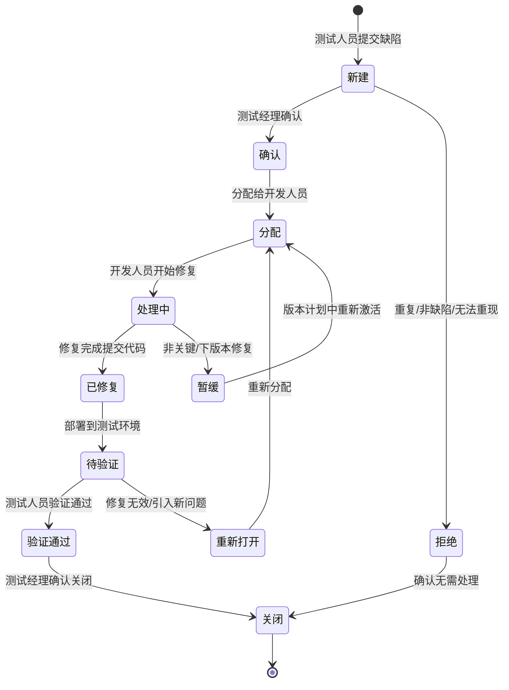

# 缺陷工作流（Defect Workflow）

## 项目信息

| 项目 | 详情 |
|------|------|
| 项目名称 | 密讯基础平台（MIT-FMP-V1.0） |
| 文档版本 | V1.0 |
| 编制日期 | 2026-03-24 |
| 编制人 | 测试经理（G10测试组） |

> 来源: Proj-Docs/10-BugManagement/Defect_Workflow.md

---

## 1. 缺陷生命周期

### 1.1 状态流转图（Mermaid）

### 1.2 状态流转矩阵

| 当前状态 ↓ → 目标状态 | 新建 | 确认 | 分配 | 处理中 | 已修复 | 待验证 | 验证通过 | 重新打开 | 暂缓 | 拒绝 | 关闭 |
|----------------------|------|------|------|--------|--------|--------|---------|---------|------|------|------|
| **新建** | - | ✓ | - | - | - | - | - | - | - | ✓ | - |
| **确认** | - | - | ✓ | - | - | - | - | - | - | - | - |
| **分配** | - | - | - | ✓ | - | - | - | - | - | - | - |
| **处理中** | - | - | - | - | ✓ | - | - | - | ✓ | - | - |
| **已修复** | - | - | - | - | - | ✓ | - | - | - | - | - |
| **待验证** | - | - | - | - | - | - | ✓ | ✓ | ✓ | - | - |
| **验证通过** | - | - | - | - | - | - | - | - | - | - | ✓ |
| **重新打开** | - | - | ✓ | - | - | - | - | - | - | - | - |
| **暂缓** | - | - | ✓ | - | - | - | - | - | - | - | - |
| **拒绝** | - | - | - | - | - | - | - | - | - | - | ✓ |
| **关闭** | - | - | - | - | - | - | - | - | - | - | - |

---

## 2. 状态详细说明

### 2.1 新建（New）

| 属性 | 说明 |
|------|------|
| 定义 | 测试人员发现缺陷后提交，初始状态 |
| 触发操作 | 测试人员提交缺陷报告 |
| 责任人 | 提交人（测试工程师） |
| 必填字段 | 标题、严重级别、模块、描述、复现步骤、预期结果、实际结果、环境信息 |
| 可选字段 | 附件（截图、日志）、建议修复方案 |

### 2.2 确认（Confirmed）

| 属性 | 说明 |
|------|------|
| 定义 | 测试经理或测试组长确认缺陷有效，非重复/非误报 |
| 触发操作 | 测试经理审核通过 |
| 责任人 | 测试经理 |
| 确认内容 | 缺陷可重现、非重复提交、严重级别正确、描述清晰 |

### 2.3 分配（Assigned）

| 属性 | 说明 |
|------|------|
| 定义 | 缺陷已分配给对应模块的开发人员 |
| 触发操作 | 测试经理/开发经理分配负责人 |
| 责任人 | 被分配的开发人员 |
| 分配依据 | 模块归属、开发人员负载、技术栈匹配 |

### 2.4 处理中（In Progress）

| 属性 | 说明 |
|------|------|
| 定义 | 开发人员正在定位和修复缺陷 |
| 触发操作 | 开发人员开始修复 |
| 责任人 | 开发人员 |
| 活动 | 定位根因、编写修复代码、自测 |

### 2.5 已修复（Fixed）

| 属性 | 说明 |
|------|------|
| 定义 | 开发人员完成修复，代码已提交 |
| 触发操作 | 开发人员提交修复代码 |
| 责任人 | 开发人员 |
| 产出 | 修复代码、修复说明、影响范围分析 |

### 2.6 待验证（Pending Verification）

| 属性 | 说明 |
|------|------|
| 定义 | 修复代码已部署到测试环境，等待测试人员验证 |
| 触发操作 | 代码部署到测试环境 |
| 责任人 | 测试人员 |
| 验证内容 | 原缺陷是否修复、是否引入回归问题、关联功能是否正常 |

### 2.7 验证通过（Verified）

| 属性 | 说明 |
|------|------|
| 定义 | 测试人员验证确认缺陷已修复，无回归问题 |
| 触发操作 | 测试人员验证通过 |
| 责任人 | 测试人员 |
| 验证要求 | 原复现步骤不再出现缺陷、相关功能回归测试通过 |

### 2.8 重新打开（Reopened）

| 属性 | 说明 |
|------|------|
| 定义 | 测试人员验证发现修复无效或引入新问题 |
| 触发操作 | 测试人员验证不通过 |
| 责任人 | 原开发人员 |
| 说明 | 需附验证失败的截图/日志，说明不通过原因 |

### 2.9 暂缓（Deferred）

| 属性 | 说明 |
|------|------|
| 定义 | 缺陷确认存在但当前版本不修复，延后处理 |
| 触发操作 | 项目经理/开发经理确认暂缓 |
| 责任人 | 项目经理 |
| 适用场景 | 非核心功能、修复风险高、影响范围小、计划下版本修复 |

### 2.10 拒绝（Rejected）

| 属性 | 说明 |
|------|------|
| 定义 | 经验证不属于缺陷，或为重复提交 |
| 触发操作 | 测试经理/开发经理拒绝 |
| 责任人 | 拒绝人 |
| 原因 | 需求理解不一致、设计如此、无法重现、重复提交 |

### 2.11 关闭（Closed）

| 属性 | 说明 |
|------|------|
| 定义 | 缺陷处理完成，最终关闭 |
| 触发操作 | 验证通过后测试经理关闭；或拒绝确认后关闭 |
| 责任人 | 测试经理 |
| 关闭前检查 | 所有必填字段完整、处理记录完整、关联测试用例更新 |

---

## 3. 角色与权限

| 角色 | 可执行操作 | 权限说明 |
|------|-----------|---------|
| 测试工程师 | 新建缺陷、验证缺陷、重新打开 | 提交和验证，不可分配/关闭 |
| 测试组长 | 确认缺陷、分配缺陷、验证缺陷、重新打开 | 审核提交质量 |
| 测试经理 | 确认缺陷、关闭缺陷、所有状态流转 | 流程管理权 |
| 开发工程师 | 处理中→已修复、暂缓申请 | 修复和申请暂缓 |
| 开发经理 | 分配缺陷、暂缓确认 | 资源分配和调度 |
| 项目经理 | 暂缓最终确认、优先级调整 | 项目决策权 |

---

## 4. 处理时限要求

| 严重级别 | 确认时限 | 分配时限 | 修复时限 | 验证时限 | 关闭时限 |
|---------|---------|---------|---------|---------|---------|
| P0致命 | 30分钟 | 30分钟 | 2小时 | 30分钟 | 30分钟 |
| P1严重 | 1小时 | 1小时 | 4小时 | 1小时 | 1小时 |
| P2一般 | 4小时 | 4小时 | 24小时 | 4小时 | 4小时 |
| P3轻微 | 24小时 | 24小时 | 72小时 | 24小时 | 24小时 |
| P4建议 | 48小时 | 48小时 | 下版本 | 48小时 | 48小时 |

### 4.1 超时处理

| 超时环节 | 处理方式 |
|---------|---------|
| 确认超时 | 自动升级到测试经理 |
| 分配超时 | 自动升级到开发经理 |
| 修复超时（P0/P1） | 升级到项目经理，启动应急处理 |
| 修复超时（P2/P3） | 每日Triage会议追踪 |
| 验证超时 | 测试经理督促验证 |

---

## 5. 缺陷管理规则

### 5.1 提交规则

- 一个缺陷只描述一个问题，禁止合并多个问题
- 标题格式：`[模块] 问题简述`
- 必须包含复现步骤和实际结果
- P0/P1缺陷必须附带截图或日志
- 提交前确认是否已有类似缺陷

### 5.2 关闭规则

- P0/P1缺陷关闭必须测试经理确认
- 关闭前必须填写根因分析和解决方案
- 验证通过后24小时内关闭
- 被拒绝的缺陷需注明拒绝原因

### 5.3 重新打开规则

- 重新打开时需注明验证不通过的具体原因
- 重新打开的缺陷优先级可提升一级
- 同一缺陷重新打开超过2次，升级到技术负责人评审

---

*文档状态：已发布 | 审阅：测试经理*