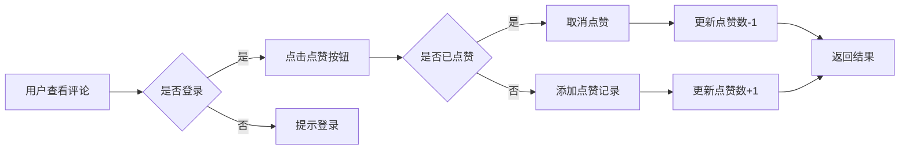
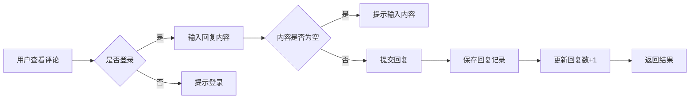

# 商城评论系统增强需求分析文档

## 1. 需求概述

### 1.1 项目背景

本项目是基于若依（RuoYi）框架二次开发的多租户企业级管理系统，包含完整的商城模块。现有商品评论系统已具备基础功能，但缺少用户互动和数据统计能力，需要进行增强以提升用户体验和运营效率。

### 1.2 需求来源

- **业务需求**：提升商城用户互动性，增强商品可信度
- **用户体验**：现有评论系统功能单一，缺乏用户互动机制
- **运营需求**：缺少评论数据统计分析能力

### 1.3 目标用户

| 用户角色 | 使用场景 |
|----------|----------|
| 商城会员 | 查看评论、发表评论、点赞评论、回复评论 |
| 管理员 | 管理评论、回复评论、查看评论统计 |

### 1.4 需求范围

本需求聚焦于商城商品评论系统的增强，不涉及其他模块的修改。

---

## 2. 现有功能分析

### 2.1 已实现功能

| 功能点 | 实现状态 | 说明 |
|--------|----------|------|
| 评论创建 | ✅ 已实现 | 支持会员端和管理后台创建 |
| 评论图片 | ✅ 已实现 | 支持上传多张图片（最多9张） |
| 评分系统 | ✅ 已实现 | 描述评分、服务评分（1-5星） |
| 商家回复 | ✅ 已实现 | 管理员可回复评论 |
| 可见性控制 | ✅ 已实现 | 管理员可隐藏/显示评论 |
| 评论筛选 | ✅ 已实现 | 会员端支持按类型筛选（全部/好评/中评/差评） |
| 匿名评论 | ✅ 已实现 | 支持匿名发表评论 |

### 2.2 待实现功能（本次需求）

| 功能点 | 优先级 | 状态 | 说明 |
|--------|--------|------|------|
| 评论点赞 | 高 | ⏳ 待实现 | 会员可点赞评论 |
| 用户回复 | 高 | ⏳ 待实现 | 会员可回复其他用户的评论 |
| 评论统计 | 中 | ⏳ 待实现 | 展示评论统计数据（好评率、平均评分等） |
| 评论排序 | 中 | ⏳ 待实现 | 支持按时间、点赞数排序 |

---

## 3. 功能需求

### 3.1 评论点赞功能

#### 3.1.1 需求描述

会员可对商品评论进行点赞，点赞后显示点赞数，支持取消点赞。

#### 3.1.2 业务规则

- 每个用户对同一条评论只能点赞一次
- 点赞后可取消点赞
- 点赞数实时更新显示
- 点赞操作无需登录用户也可查看，但需要登录才能点赞

#### 3.1.3 界面原型

```
评论列表项：
┌─────────────────────────────────────────────┐
│ [用户头像] [用户名]                        │
│ ⭐⭐⭐⭐⭐ 描述5星 服务5星                   │
│                                            │
│ [评论内容]                                  │
│ [图片1] [图片2] [图片3]                    │
│                                            │
│ 👍 点赞(12)  💬 回复(3)  🕐 2026-07-12    │
└─────────────────────────────────────────────┘
```

#### 3.1.4 数据模型变更

**新增表：`product_comment_like`**

| 字段名 | 类型 | 说明 |
|--------|------|------|
| id | BIGINT | 主键 |
| comment_id | BIGINT | 评论ID（外键） |
| user_id | BIGINT | 用户ID（外键） |
| create_time | DATETIME | 创建时间 |
| tenant_id | BIGINT | 租户ID |

**修改表：`product_comment`**

| 字段名 | 类型 | 说明 |
|--------|------|------|
| like_count | INT | 点赞数（新增，默认0） |

#### 3.1.5 API接口

| 接口 | 方法 | 说明 |
|------|------|------|
| `/app-api/comment/like` | POST | 点赞/取消点赞 |
| `/app-api/comment/get-like-status` | GET | 查询点赞状态 |

### 3.2 用户回复功能

#### 3.2.1 需求描述

会员可回复其他用户的评论，形成评论互动。

#### 3.2.2 业务规则

- 支持多级回复（回复的回复）
- 回复内容限制在500字以内
- 回复需要登录
- 商家回复和用户回复分开显示

#### 3.2.3 界面原型

```
评论详情：
┌─────────────────────────────────────────────┐
│ [用户头像] [用户名]                        │
│ ⭐⭐⭐⭐⭐ 描述5星 服务5星                   │
│                                            │
│ [评论内容]                                  │
│ [图片1] [图片2]                            │
│                                            │
│ 👍 点赞(12)  💬 回复(3)                    │
│                                            │
│ ── 回复列表 ──                              │
│                                            │
│ [回复用户A]: 这个颜色好看吗？               │
│   [回复用户B]: 很好看，我买的就是这个颜色   │
│                                            │
│ [回复用户C]: 质量怎么样？                   │
│                                            │
│ [商家回复]: 感谢您的支持，质量保证！        │
│                                            │
│ [输入框] + [发送按钮]                       │
└─────────────────────────────────────────────┘
```

#### 3.2.4 数据模型变更

**新增表：`product_comment_reply`**

| 字段名 | 类型 | 说明 |
|--------|------|------|
| id | BIGINT | 主键 |
| comment_id | BIGINT | 评论ID（外键） |
| user_id | BIGINT | 用户ID（外键） |
| parent_id | BIGINT | 父回复ID（用于多级回复，默认0） |
| content | VARCHAR(500) | 回复内容 |
| user_nickname | VARCHAR(64) | 用户昵称 |
| user_avatar | VARCHAR(256) | 用户头像 |
| create_time | DATETIME | 创建时间 |
| tenant_id | BIGINT | 租户ID |

**修改表：`product_comment`**

| 字段名 | 类型 | 说明 |
|--------|------|------|
| reply_count | INT | 回复数（新增，默认0） |

#### 3.2.5 API接口

| 接口 | 方法 | 说明 |
|------|------|------|
| `/app-api/comment/reply` | POST | 发表回复 |
| `/app-api/comment/replies` | GET | 获取回复列表 |

### 3.3 评论统计功能

#### 3.3.1 需求描述

在商品详情页和管理后台展示评论统计数据。

#### 3.3.2 统计指标

| 指标 | 说明 |
|------|------|
| 总评论数 | 该商品的所有评论数量 |
| 好评率 | 好评（4-5星）占比 |
| 平均评分 | 描述评分和服务评分的平均值 |
| 有图评论数 | 带图片的评论数量 |
| 各星级分布 | 1-5星评论数量及占比 |

#### 3.3.3 API接口

| 接口 | 方法 | 说明 |
|------|------|------|
| `/app-api/comment/statistics` | GET | 获取评论统计 |

### 3.4 评论排序功能

#### 3.4.1 需求描述

支持按不同维度对评论进行排序。

#### 3.4.2 排序方式

| 排序方式 | 说明 |
|----------|------|
| 最新 | 按评论时间倒序 |
| 最热 | 按点赞数倒序 |
| 有图 | 优先显示带图片的评论 |

---

## 4. 业务流程

### 4.1 点赞流程



### 4.2 回复流程



---

## 5. 非功能需求

### 5.1 性能要求

- 评论列表接口响应时间 < 200ms
- 点赞/回复操作响应时间 < 100ms
- 支持并发1000+用户同时操作

### 5.2 安全要求

- 所有接口需进行权限校验
- 防止SQL注入攻击
- 用户输入内容需进行敏感词过滤

### 5.3 国际化要求

- 所有新增面向用户的文本需添加国际化支持
- 涉及语言：中文（zh-CN）、英文（en）、阿拉伯语（ar）

---

## 6. 验收标准

### 6.1 功能验收

| 功能 | 验收标准 |
|------|----------|
| 点赞功能 | 用户可正常点赞/取消点赞，点赞数实时更新 |
| 回复功能 | 用户可发表回复，回复列表正确展示 |
| 评论统计 | 统计数据准确，与实际评论数据一致 |
| 排序功能 | 按不同维度排序结果正确 |

### 6.2 性能验收

| 指标 | 验收标准 |
|------|----------|
| 接口响应时间 | 所有接口响应时间 < 200ms |
| 并发测试 | 1000并发用户下系统稳定运行 |

### 6.3 安全验收

| 指标 | 验收标准 |
|------|----------|
| 权限校验 | 未登录用户无法点赞/回复 |
| SQL注入 | 无法通过输入恶意SQL进行攻击 |

---

## 7. 风险评估

| 风险 | 等级 | 应对措施 |
|------|------|----------|
| 数据量增长影响性能 | 中 | 对点赞表、回复表添加索引，考虑分表 |
| 恶意刷赞/刷回复 | 中 | 添加频率限制，IP限流 |
| 敏感内容发布 | 低 | 集成敏感词过滤 |

---

## 8. 开发计划

### 8.1 后端开发

| 阶段 | 任务 | 预计时间 |
|------|------|----------|
| 1 | 数据库表设计与创建 | 0.5天 |
| 2 | DO、Mapper、Service层开发 | 1天 |
| 3 | Controller层API开发 | 0.5天 |
| 4 | 单元测试 | 0.5天 |

### 8.2 前端开发

| 阶段 | 任务 | 预计时间 |
|------|------|----------|
| 1 | 商城H5评论列表增强 | 1天 |
| 2 | 商城H5评论详情/回复 | 1天 |
| 3 | 管理后台评论统计 | 0.5天 |
| 4 | 国际化文本添加 | 0.5天 |

### 8.3 总计

**预计开发周期：5天**

---

> 文档版本：V1.0  
> 创建日期：2026-07-12  
> 创建人：qingzi