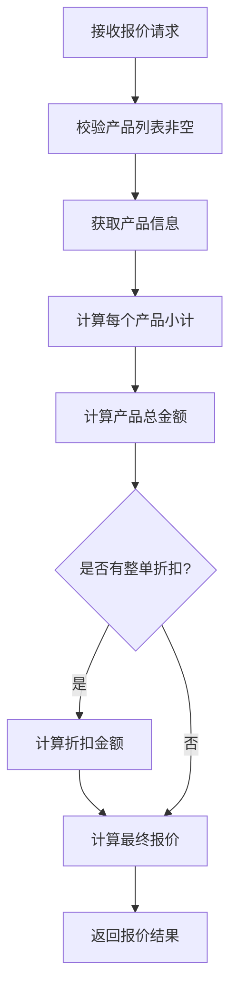
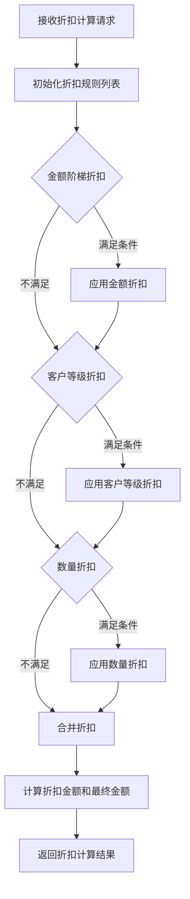

# 产品报价接口设计文档

## 一、设计概述

### 1.1 设计目标
基于需求分析，设计产品报价接口和报价折扣计算接口，实现以下功能：
1. 根据产品列表和数量计算报价金额
2. 根据多种条件计算折扣
3. 提供清晰的报价明细和折扣信息

### 1.2 设计原则
- 复用现有产品服务和金额计算工具类
- 接口设计简洁，参数明确
- 支持后续扩展折扣规则配置

---

## 二、接口设计

### 2.1 产品报价接口

#### 2.1.1 接口信息
| 属性 | 值 |
|------|------|
| 路径 | `/crm/quote/calculate` |
| 方法 | POST |
| 描述 | 根据产品列表和数量计算报价 |

#### 2.1.2 请求参数

**CrmQuoteCalculateReqVO**

| 字段名 | 类型 | 必填 | 说明 |
|--------|------|------|------|
| products | List\<Product\> | 是 | 产品列表 |
| discountPercent | BigDecimal | 否 | 整单折扣百分比，默认 0 |

**Product（内部类）**

| 字段名 | 类型 | 必填 | 说明 |
|--------|------|------|------|
| productId | Long | 是 | 产品编号 |
| count | BigDecimal | 是 | 购买数量，最小为 1 |

#### 2.1.3 响应参数

**CrmQuoteCalculateRespVO**

| 字段名 | 类型 | 说明 |
|--------|------|------|
| totalProductPrice | BigDecimal | 产品总金额（未折扣），单位：元 |
| discountPercent | BigDecimal | 整单折扣百分比 |
| discountAmount | BigDecimal | 折扣金额，单位：元 |
| totalPrice | BigDecimal | 最终报价金额，单位：元 |
| products | List\<Product\> | 产品明细列表 |

**Product（内部类）**

| 字段名 | 类型 | 说明 |
|--------|------|------|
| productId | Long | 产品编号 |
| productName | String | 产品名称 |
| productNo | String | 产品编码 |
| productPrice | BigDecimal | 产品单价，单位：元 |
| count | BigDecimal | 购买数量 |
| totalPrice | BigDecimal | 产品小计，单位：元 |

#### 2.1.4 示例

**请求**：
```json
{
  "products": [
    {"productId": 1, "count": 10},
    {"productId": 2, "count": 5}
  ],
  "discountPercent": 10
}
```

**响应**：
```json
{
  "code": 0,
  "msg": "",
  "data": {
    "totalProductPrice": 1500,
    "discountPercent": 10,
    "discountAmount": 150,
    "totalPrice": 1350,
    "products": [
      {"productId": 1, "productName": "产品A", "productNo": "P001", "productPrice": 100, "count": 10, "totalPrice": 1000},
      {"productId": 2, "productName": "产品B", "productNo": "P002", "productPrice": 100, "count": 5, "totalPrice": 500}
    ]
  }
}
```

### 2.2 报价折扣计算接口

#### 2.2.1 接口信息
| 属性 | 值 |
|------|------|
| 路径 | `/crm/quote/discount-calculate` |
| 方法 | POST |
| 描述 | 根据条件计算折扣 |

#### 2.2.2 请求参数

**CrmQuoteDiscountCalculateReqVO**

| 字段名 | 类型 | 必填 | 说明 |
|--------|------|------|------|
| totalAmount | BigDecimal | 是 | 订单总金额，单位：元 |
| customerLevel | Integer | 否 | 客户等级（1-普通，2-银卡，3-金卡，4-钻石） |
| productCount | Integer | 否 | 产品总数量 |
| businessTypeId | Long | 否 | 业务类型ID |

#### 2.2.3 响应参数

**CrmQuoteDiscountCalculateRespVO**

| 字段名 | 类型 | 说明 |
|--------|------|------|
| discountPercent | BigDecimal | 计算出的折扣百分比 |
| discountAmount | BigDecimal | 折扣金额，单位：元 |
| finalAmount | BigDecimal | 折扣后的金额，单位：元 |
| rules | List\<DiscountRule\> | 应用的折扣规则列表 |

**DiscountRule（内部类）**

| 字段名 | 类型 | 说明 |
|--------|------|------|
| ruleName | String | 规则名称 |
| discountPercent | BigDecimal | 规则折扣百分比 |
| description | String | 规则描述 |

#### 2.2.4 示例

**请求**：
```json
{
  "totalAmount": 5000,
  "customerLevel": 3,
  "productCount": 20
}
```

**响应**：
```json
{
  "code": 0,
  "msg": "",
  "data": {
    "discountPercent": 15,
    "discountAmount": 750,
    "finalAmount": 4250,
    "rules": [
      {"ruleName": "金额阶梯折扣", "discountPercent": 10, "description": "满5000打9折"},
      {"ruleName": "客户等级折扣", "discountPercent": 5, "description": "金卡会员额外5折"}
    ]
  }
}
```

---

## 三、类设计

### 3.1 Controller

**CrmQuoteController**

| 方法名 | 参数 | 返回值 | 说明 |
|--------|------|--------|------|
| calculateQuote | CrmQuoteCalculateReqVO | CommonResult\<CrmQuoteCalculateRespVO\> | 计算产品报价 |
| calculateDiscount | CrmQuoteDiscountCalculateReqVO | CommonResult\<CrmQuoteDiscountCalculateRespVO\> | 计算折扣 |

### 3.2 Service

**CrmQuoteService（接口）**

| 方法名 | 参数 | 返回值 | 说明 |
|--------|------|--------|------|
| calculateQuote | CrmQuoteCalculateReqVO | CrmQuoteCalculateRespVO | 计算产品报价 |
| calculateDiscount | CrmQuoteDiscountCalculateReqVO | CrmQuoteDiscountCalculateRespVO | 计算折扣 |

**CrmQuoteServiceImpl（实现）**

| 方法名 | 说明 |
|--------|------|
| calculateQuote | 调用 productService 获取产品信息，计算报价 |
| calculateDiscount | 根据条件计算折扣，支持多种规则 |
| calculateAmountDiscount | 金额阶梯折扣计算 |
| calculateCustomerLevelDiscount | 客户等级折扣计算 |
| calculateQuantityDiscount | 数量折扣计算 |

### 3.3 VO 类

**CrmQuoteCalculateReqVO**
- 路径：`controller/admin/quote/vo/CrmQuoteCalculateReqVO.java`

**CrmQuoteCalculateRespVO**
- 路径：`controller/admin/quote/vo/CrmQuoteCalculateRespVO.java`

**CrmQuoteDiscountCalculateReqVO**
- 路径：`controller/admin/quote/vo/CrmQuoteDiscountCalculateReqVO.java`

**CrmQuoteDiscountCalculateRespVO**
- 路径：`controller/admin/quote/vo/CrmQuoteDiscountCalculateRespVO.java`

---

## 四、流程设计

### 4.1 产品报价流程



### 4.2 折扣计算流程



---

## 五、折扣规则设计

### 5.1 金额阶梯折扣规则

| 金额区间（元） | 折扣百分比 |
|----------------|------------|
| 0 - 1000 | 0% |
| 1000 - 5000 | 5% |
| 5000 - 10000 | 10% |
| 10000+ | 15% |

### 5.2 客户等级折扣规则

| 客户等级 | 折扣百分比 |
|----------|------------|
| 普通（1） | 0% |
| 银卡（2） | 3% |
| 金卡（3） | 5% |
| 钻石（4） | 8% |

### 5.3 数量折扣规则

| 数量区间 | 折扣百分比 |
|----------|------------|
| 0 - 10 | 0% |
| 10 - 50 | 2% |
| 50+ | 5% |

### 5.4 折扣合并规则
- 所有折扣可以叠加
- 最大折扣不超过 50%

---

## 六、依赖关系

| 依赖类 | 说明 |
|--------|------|
| CrmProductService | 获取产品信息和价格 |
| MoneyUtils | 金额计算工具类 |
| BaseDO | 基础数据对象 |

---

## 七、异常处理

| 异常场景 | 错误码 | 错误信息 |
|----------|--------|----------|
| 产品列表为空 | 102005001 | 产品列表不能为空 |
| 产品不存在 | 102005002 | 产品不存在 |
| 购买数量小于1 | 102005003 | 购买数量不能小于1 |
| 订单金额小于0 | 102005004 | 订单金额不能小于0 |
