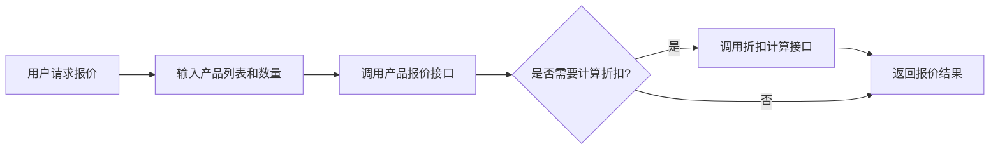

# 产品报价接口需求分析

## 一、需求背景

### 1.1 业务场景
在 CRM 系统中，销售人员需要为客户提供产品报价方案。现有系统中，商机模块已经包含了产品价格和折扣计算逻辑，但缺少独立的产品报价接口。业务需要：

1. **产品报价查询**：根据产品列表和数量，快速计算出报价金额
2. **折扣计算**：根据不同条件（如购买数量、客户等级等）计算折扣
3. **报价方案对比**：支持多种报价方案的对比

### 1.2 现有功能分析

现有系统中，商机模块已实现以下价格计算逻辑：

| 逻辑 | 位置 | 说明 |
|------|------|------|
| 产品价格计算 | `CrmBusinessServiceImpl.validateBusinessProducts()` | `totalPrice = businessPrice * count` |
| 总价计算 | `CrmBusinessServiceImpl.calculateTotalPrice()` | `totalPrice = totalProductPrice - discount` |
| 折扣计算 | `CrmBusinessServiceImpl.calculateTotalPrice()` | `discount = totalProductPrice * discountPercent` |

现有功能不足：
- 缺少独立的报价接口，必须创建商机才能计算报价
- 缺少灵活的折扣规则配置
- 缺少报价方案管理

---

## 二、功能需求

### 2.1 产品报价接口

**需求描述**：根据产品列表和数量，计算报价金额

**输入参数**：
| 参数名 | 类型 | 必填 | 说明 |
|--------|------|------|------|
| products | Array | 是 | 产品列表 |
| products[].productId | Long | 是 | 产品编号 |
| products[].count | BigDecimal | 是 | 购买数量 |
| discountPercent | BigDecimal | 否 | 整单折扣（百分比），默认 0 |

**输出结果**：
| 参数名 | 类型 | 说明 |
|--------|------|------|
| totalProductPrice | BigDecimal | 产品总金额（未折扣） |
| discountPercent | BigDecimal | 整单折扣百分比 |
| discountAmount | BigDecimal | 折扣金额 |
| totalPrice | BigDecimal | 最终报价金额 |
| products | Array | 产品明细 |
| products[].productId | Long | 产品编号 |
| products[].productName | String | 产品名称 |
| products[].productPrice | BigDecimal | 产品单价 |
| products[].count | BigDecimal | 购买数量 |
| products[].totalPrice | BigDecimal | 产品小计 |

### 2.2 报价折扣计算接口

**需求描述**：根据不同条件计算折扣

**输入参数**：
| 参数名 | 类型 | 必填 | 说明 |
|--------|------|------|------|
| totalAmount | BigDecimal | 是 | 订单总金额 |
| customerLevel | Integer | 否 | 客户等级（1-普通，2-银卡，3-金卡，4-钻石） |
| productCount | Integer | 否 | 产品数量 |
| businessTypeId | Long | 否 | 业务类型ID |

**输出结果**：
| 参数名 | 类型 | 说明 |
|--------|------|------|
| discountPercent | BigDecimal | 计算出的折扣百分比 |
| discountAmount | BigDecimal | 折扣金额 |
| finalAmount | BigDecimal | 折扣后的金额 |
| rules | Array | 应用的折扣规则 |
| rules[].ruleName | String | 规则名称 |
| rules[].discountPercent | BigDecimal | 规则折扣百分比 |

### 2.3 折扣规则配置（扩展需求）

**需求描述**：支持配置多种折扣规则

**规则类型**：
| 规则类型 | 说明 | 示例 |
|----------|------|------|
| 金额阶梯折扣 | 根据订单金额区间设置折扣 | 满1000打9折，满5000打8折 |
| 客户等级折扣 | 根据客户等级设置折扣 | 银卡95折，金卡9折，钻石85折 |
| 数量折扣 | 根据购买数量设置折扣 | 买10件以上打9折 |
| 业务类型折扣 | 根据业务类型设置折扣 | 特定业务类型额外折扣 |

---

## 三、非功能需求

### 3.1 性能要求
- 报价计算接口响应时间 ≤ 50ms
- 支持批量产品报价（最多100个产品）

### 3.2 数据一致性
- 报价计算使用实时产品价格
- 折扣规则变更后立即生效

### 3.3 扩展性
- 支持新增折扣规则类型
- 支持规则优先级配置

---

## 四、业务流程

---

## 五、需求优先级

| 需求 | 优先级 | 说明 |
|------|--------|------|
| 产品报价接口 | P0 | 核心功能，必须实现 |
| 报价折扣计算接口 | P0 | 核心功能，必须实现 |
| 折扣规则配置 | P1 | 扩展功能，后续实现 |

---

## 六、依赖关系

| 依赖模块 | 说明 |
|----------|------|
| CrmProductService | 获取产品信息和价格 |
| MoneyUtils | 金额计算工具类 |
